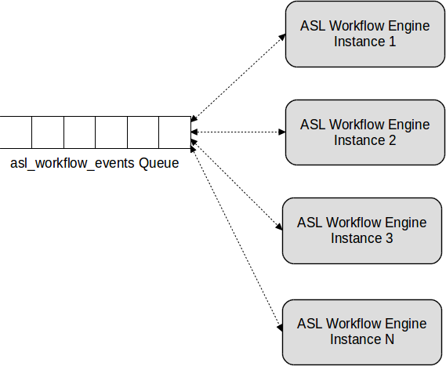
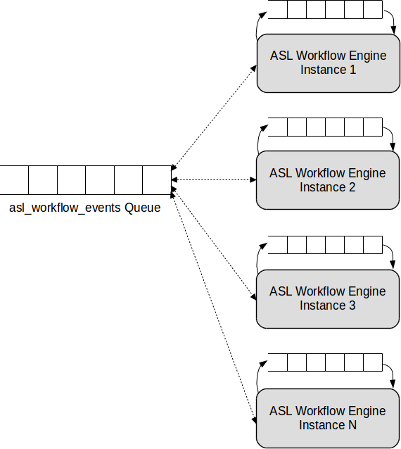
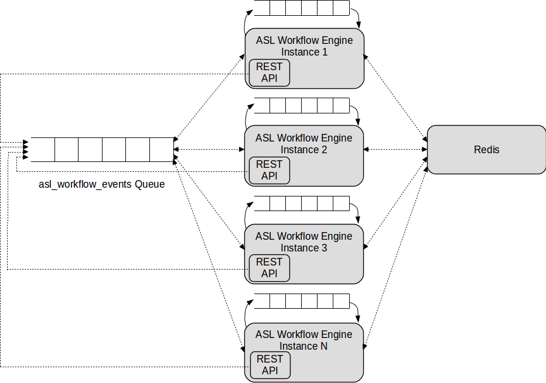

# Clustering and Scaling
### Shared Queue
The initial concept for the ASL Workflow Engine was simply to create an engine that implemented the [Amazon States Language](https://states-language.net/spec.html), without really considering lifecycle or observability issues.

The [Initial Design Choices](initial_design_choices.md) document explains that, as the current state name and application data are passed in the application context via the messaging fabric, the basic engine is stateless. With this simple model the only real requirement for scaling is that the ASL state machine has to be available to every Workflow Engine instance in the cluster.

For that simple model a single shared queue was used and scaling may be achieved simply by adding Workflow Engine instances.

### Shared Queue Plus Per-instance Queues
Although simple, there are several issues with a single shared queue design.

One issue becomes apparent as we introduce ASL [Parallel](https://states-language.net/spec.html#parallel-state) and [Map](https://states-language.net/spec.html#map-state) states. Those states run nested state machines (called Branches or Iterators) and conceptually implement a [barrier](https://en.wikipedia.org/wiki/Barrier_(computer_science)) to wait for all of the results from the nested state machines before progressing to the next state.

In order to successfully implement the Parallel or Map state barrier it is necessary to maintain state about all of the collected results. If we wish to avoid sharing state across instances it is necessary to ensure that the results of each Branch or Iterator are returned to the same instance and an obvious way to do that is by using per-instance queues.

Another issue with a single shared queue relates to performance. If any performance bottleneck is due to Workflow Engine instances being compute-bound then a shared event queue is a reasonable approach. In practice however the Workflow Engine instances do relatively little on each state transition. It is far more likely therefore that the messaging fabric will become a bottleneck and as concurrency and scaling in most messaging systems tends to be based on queue consumers, having a queue per-instance is likely to scale better.

To avoid these and other issues the approach we have taken is to only use the shared queue to deliver execution start events, so that *executions* are distributed across Workflow Engine instances. Subsequent events however are delivered via the per-instance queues so that any given execution has "affinity" for a given Workflow Engine instance. This approach should maximise opportunities for concurrency in the messaging fabric and also provide opportunities for caching execution metadata within a Workflow Engine instance that would not be possible if executions were "sharded" across multiple instances.

Whilst it would be possible to use queues with temporary broker-supplied names for the per-instance queues if we wish to allow in-progress executions to survive restarts of any given Workflow Engine instance each instance should have a repeatable, but unique, name.

For the ASL Workflow engine we supply an instance_id as part of the [configuration](configuration.md) (or populate the EVENT_QUEUE_INSTANCE_ID environment variable). This can be an arbitrary unique ID and the per-instance queue is named asl_workflow_events-&lt;instance_id&gt;. Unlike the shared queue, each per-instance queue is configured to request an exclusive subscription (via the AMQP 0.9.1 basic.consume or AMQP 0.10 message.subscribe protocol commands) which will ensure that only a single consumer can consume messages from each per-instance queue.

### REST API and Redis
As work on the ASL Workflow Engine progressed it became clear that some way would be needed to ensure that the ASL state machines are visible across all instances and that the CRUD lifecycle of the state machines could be effectively managed.

Moreover, it became clear that some form of "observability API" was required to be able to understand how executions progress through the ASL state machines, both for system diagnostics and also so that applications can determine whether executions have completed and what their output might be.

After considering a few options the most obvious approach was to implement the [AWS StepFunctions API](https://docs.aws.amazon.com/step-functions/latest/apireference/Welcome.html). Some of the reasoning for this decision includes:

* Designing good APIs is hard, so using an existing one makes sense.
* The AWS StepFunctions API has excellent documentation.
* Implementing that API means AWS tooling like the CLI and SDKs for a range of programming languages "just work".
* There is a wide range of patterns, idioms, blogs, guidance and example code available on the Internet.
* Transferable skills.
* Building a hybrid AWS/on-premises system becomes easier and can have a unified architecture.

Whilst implementing the observability parts of the AWS StepFunctions API ([DescribeExecution](https://docs.aws.amazon.com/step-functions/latest/apireference/API_DescribeExecution.html), [GetExecutionHistory](https://docs.aws.amazon.com/step-functions/latest/apireference/API_GetExecutionHistory.html), etc.) it became clear that some mechanism was required that would allow an API call, that might be load-balanced to any given instance, to retrieve execution information for any execution. The implication of this is that a potentially durable shared view was required and [Redis](https://redis.io/) is a good fit for such a store.

The diagram illustrates the REST API as part of the ASL Workflow Engine and indeed launching an instance of the Workflow Engine will launch its REST API. This, however, is not the complete picture. Although launched together, the REST API is actually largely decoupled by design from the other parts of the ASL Workflow Engine. The API calls map to calls to the ASL store, the execution store and execution history store, which are all backed by a Redis store. The exception to this is the StartExecution API call, which causes a start message to be published to the asl_workflow_events queue.

This means that a StartExecution API call load-balanced to one instance of the ASL Workflow Engine could result in the execution actually being run on a different instance and a DescribeExecution call could be load-balanced to a third instance, yet still retrieve the correct result as the call is backed by the shared Redis store.

The implication of this architecture is that it would possible, if necessary, to run fewer (or more) instances of the REST API than instances of the Workflow Engine. Moreover, if the messaging fabric were to become a bottleneck then it would be possible to run multiple message brokers and configure some instances to point to each broker. This means that the only *actual* system bottleneck is the Redis server, which could itself be clustered if necessary.

### Under the Skin of the Redis Store
The Redis Store implemented in the ASL Workflow Engine is a Redis backed container class implementing dict (or more correctly collections.abc.MutableMapping) semantics. It is intended to be subclassed by RedisDictStore and RedisListStore as the use case is for storing a dict of dicts or a dict of lists.

To store a basic dict or list a Redis [hash](https://redislabs.com/ebook/part-1-getting-started/chapter-1-getting-to-know-redis/1-2-what-redis-data-structures-look-like/1-2-4-hashes-in-redis/) or [list](https://redislabs.com/ebook/part-1-getting-started/chapter-1-getting-to-know-redis/1-2-what-redis-data-structures-look-like/1-2-2-lists-in-redis/) would suffice and the [Pottery](https://github.com/brainix/pottery) library gives those dict or list semantics. It is even possible to store a dict or list inside a Pottery RedisDict or RedisList. The issue with using those to store dicts of dict or dicts of list is that those objects are (transparently) JSON serialised. That is potentially not an issue for small and infrequently used items, but for objects that change a lot or could grow quite large, such as lists, the serialisation costs is O(2N) *for every change*, as each change to the object requires deserialisation->modification->serialisation.

RedisStore basically just manages the indexes of Redis hash or list objects (wrapped in Pottery RedisDict or RedisList). Redis itself actually indexes those, but the RedisStore class applies an appropriate key prefix to disambiguate/namespace them and wraps the accesses in Python dict semantics so applications can access the RedisStore as if it were a dict of dicts or dict of lists, minimising any changes needed to the application in order to use the store.

The reason we have RedisDictStore and RedisListStore specialisations is mainly because Redis does not allow empty hashes or lists, so if an application were to store say an empty list when it came to accessing that there would be no way of knowing its type without storing additional information. There are lots of ways to do that, but they all require additional writes and reads to the Redis server. As most applications are likely to want a dict of dicts or a dict of lists rather than a dict of dicts or lists it seems better to create specialisations rather than a more general form with additional cost.

RedisStore makes use of [Redis Server Assisted Client Side Caching](https://engineering.redislabs.com/posts/redis-assisted-client-side-caching-in-python/) where available (requires Redis > 6.0.0). This is enabled by accessing an object via the get_cached_view() method rather than the get() method. The intended use case is again to mitigate deserialisation costs for objects accessed frequently. An example might be where we have JSON objects stored in a dict that we store in RedisStore. The get_cached_view() method will retrieve the object and deserialise it and store the *deserialised* object in an [LRU cache](https://en.wikipedia.org/wiki/Cache_replacement_policies). If that object is modified Redis will send a cache invalidation message and the object will be removed from the cache. Using RSACSC is of particular benefit for handling the ASL state machines, which are created or modified infrequently but are read on every state transition.
